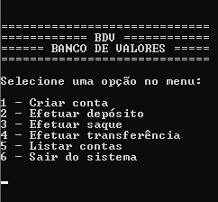

# SISTEMA DE BANCO

Projeto em C desenvolvido com os conhecimentos adquiridos nas aulas do curso da Geek University na Udemy. 

Esse é um sistema em linguagem C que simula as operações básicas de um banco. Devido a seus variados recursos é recomendado o uso da IDE CodeBlocks para sua execução plena.

 
É possível criar variadas contas, ao executar a opção depósito é gerado um saldo positivo possibilitando prosseguir com as demais ações como saque e transferência. 

Há espaço para mais validações e desenvolvimento dos processos, é um projeto que será aperfeiçoado.
